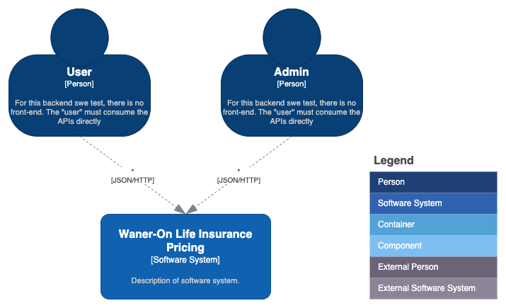
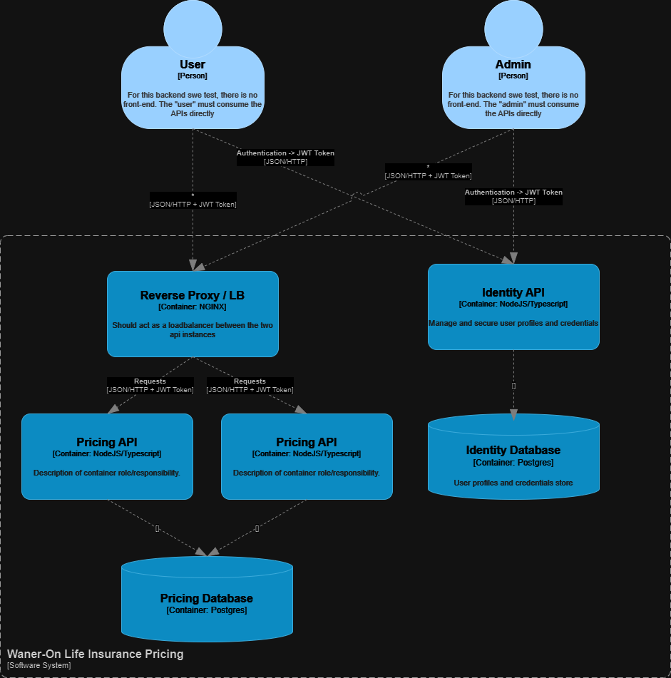

# Challenge

The contribution capacity of an SWE (Software Engineer) is to deliver value by directly participating in technical refinement, working on problems with open or undefined scopes, contributing to technical decisions, and being part of the solution creation process. Additionally, they contribute to the technical growth of junior engineers.

The person:
- Works on problems with open or undefined scopes;
- Primarily collaborates with their direct team and cross-functional teams, fostering collaboration among all stakeholders in the project;
- Has autonomy in their daily tasks and does not require supervision for making decisions about solution details;
- Contributes to the technical decisions of the team;
- Is part of the solution creation process;
- Helps junior engineers improve their technical skills.

## Case - Waner-On Life Insurance Pricing

You work for an InsurTech called Waner-On Insurance. The company has been growing exponentially, and its young customer base is demanding more modern and flexible products that better align with current realities.

The product team conducted a discovery with the target audience and concluded that Waner-On's life insurance product needs to be more dynamic in terms of coverage. It should allow customers to choose the coverages they want and have more precise pricing that considers the individual's age, occupation, and location.

As an SWE, your tech leader assigned you the task of designing and implementing the new life insurance pricing functionality.

For this case, we will provide the initial data, which **must be loaded into the database of your choice during the solution's startup.**

## Requirements

Check the documentation for each user story by clicking on the `US-X` identifier. Keep in mind that the `admin` user stories can only be executed by admins, while the `user` stories can be executed by both admins and users.

### Identity API

#### [US-1](./docs/user-stories/identity-api/us-1-user-registration.md) - As an Admin, I can register new `admin` users by providing their email and password.

#### [US-2](./docs/user-stories/identity-api/us-2-change-user-role.md) - As an Admin, I can change a user's role to `user` or `admin`.

#### [US-3](./docs/user-stories/identity-api/us-3-user-login.md) - As a User, I can log in with the password provided by the Admin to generate a JWT token and consume the pricing API.

### Pricing API - Admin

#### [US-4](./docs/user-stories/pricing-api-admin/us-4-create-coverage.md) - As an Admin, I can register a new type of coverage so it can be selected during pricing.

#### [US-5](./docs/user-stories/pricing-api-admin/us-5-edit-coverage.md) - As an Admin, I can modify a coverage to ensure pricing is up to date.

#### [US-6](./docs/user-stories/pricing-api-admin/us-6-remove-coverage.md) - As an Admin, I can remove a coverage to prevent it from being used in pricing.

### Pricing API - User

#### [US-7](./docs/user-stories/pricing-api-user/us-7-dynamic-pricing.md) - As a User, I can price a life insurance policy based on parameters and coverages to provide accurate and suitable pricing for customers.

## Architecture

You must fully implement the `Waner-On Life Insurance Pricing` system for dynamic insurance pricing.

The Waner-On Life Insurance Pricing system must be implemented using the following architecture as a minimum:

Don't forget to complement the diagrams with your developments ;)

### Authentication

For this case, you must use token-based authentication signed with an asymmetric key. The `identity API` must generate a **JWT** that will be used in calls to the `pricing API` using the **Bearer** scheme. To simplify testing, the `pricing API` can pre-know the public part of the key to validate tokens.

## Stack

You are free to choose any library, database, or software architecture you prefer, but remember that you will need to argue and defend your choices. However, there are a few technical requirements:

- Use NodeJS in its LTS version.
- Implement the code in TypeScript.
- Use Docker Compose to run the entire solution.

## Instructions

- All services used to resolve the case must be started locally using `docker compose`, including the implemented services and any database you find necessary. Limit the resources to 2 vCPUs and 4GB of memory in the Docker Compose configuration.
  
- The test will be executed using the command `docker compose up`. Make sure to configure everything correctly so that the images build and run properly.

- Do not forget to provide all the necessary instructions for running the implemented tests, generating a coverage report in lcov format.

- Upon starting the solution, the pricing API must run on two instances, exposed via NGINX on port 3000 of localhost.

- Upon starting the solution, the identity API must be exposed on port 3030 of localhost.

## Evaluation Criteria

- Correct understanding of the requirements and documentation.

- On-time delivery within the agreed deadline.

- Proper use of HTTP codes for success and error cases.

- Code quality. We will consider the use of development patterns such as GoF Design Patterns, GRASP, DRY, KIS, and SOLID. We will also evaluate code clarity and the presence of code smells.

- Correct use of the provided data structures.
  
- Argumentation of trade-offs and technical choices, such as project structuring, data handling algorithms, etc.

- Coverage of unit tests.

- Adherence to the requested stack.

- Correct implementation of the requirements (validated through load and automated end-to-end tests).

## Bonus

Not implementing these will not be considered a negative, but the following challenges are certainly welcome:

- End-to-end tests
- Log organization
- Performance optimization
- Resource usage optimization (CPU and memory)
- Something unexpected
