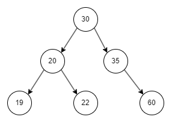

# Waner-On Life Insurance Pricing

## US-7 - As a User, I can price a life insurance policy based on parameters and coverages to provide accurate and appropriate pricing for clients.

Dynamic pricing for life insurance is where you will use the `seed` data for age and occupation, along with the selected coverages.

### Pricing Inputs:
- Insured person's age.
- Insured person's occupation (occupation code).
- Selected coverages.
- Sum assured (insured capital).

For this case, consider that the sum assured must not be less than 10,000 and greater than 10,000,000.

### Premium Calculation
The premium for the insurance is calculated as the sum of the premiums for each coverage, multiplied by the occupation and age factors.

To calculate the premium for each coverage, use the following formula:
`(Coverage capital / Sum assured) * Coverage premium`. If the division is not an integer, round up to the next whole number before multiplying by the premium.

Once this coverage premium value is calculated, multiply it by the occupation and age factors. The response payload should include these calculated values for each coverage, as well as the total premium.

It must not be possible to price a life insurance policy for an inactive occupation or for ages under 18 and over 60 years.

### Age Factor
For this test, the age factor must be stored in a balanced binary tree structure. On API startup, the age data must be loaded into the tree, and during pricing, the correct factor must be retrieved by navigating the tree.

For example, with the following age dataset:
```json
[
  { "age": 19, "factor": 0.8 },
  { "age": 20, "factor": 1 },
  { "age": 22, "factor": 1.25 },
  { "age": 30, "factor": 1.75 },
  { "age": 35, "factor": 2 },
  { "age": 60, "factor": 4 }
]
```

The tree should look like this:


The factor must be that of the exact age provided or the next closest factor. For example, with this dataset, if age 33 is provided, the factor considered should be from age 35, which is `2`.

Example (using seed data):
Inputs

Age: 26 → factor found = 1.75 (age 30)
Occupation: 223280 → Dentist, ACTIVE, factor found = 1.02
Capital: R$ 100,000
Coverages:
Special Indemnity for Accidental Death: Premium 20, Capital 15,000
Disability: Premium 10, Capital 10,000
Calculation

Special Indemnity for Accidental Death:
100,000 / 15,000 = 6.666
Round up → 7
7 * 20 = 140
140 * 1.75 * 1.02 = 249.9

Disability:
100,000 / 10,000 = 10
10 * 10 = 100
100 * 1.75 * 1.02 = 178.5

Total Premium:
249.9 + 178.5 = 428.4

**POST** `/quote`

Request Payload
```json
{
  "age": <number>,
  "occupationCode": <string>,
  "capital": <number>,
  "coverages": <stringIds>

}
```

Response Payload - HTTP STATUS `200`
```json
{
  "ageFactor": <number>,
  "occupationFactor": <number>,
  "coverages": [
    {
      "coverageId": <string>,
      "premium": <string> // valor calculado
    },
  ],
  "capital": <number>,
  "premium": <number>
}
```

Error Response - HTTP STATUS `400`
```json
{
    "error": {
        "code": <string>,
        "message": <string>
    }
}
```

Error Response - HTTP STATUS `401`
```json
{
    "error": {
        "code": <string>,
        "message": <string>
    }
}
```

Error Response - HTTP STATUS `500`
```json
{
    "error": {
        "code": <string>,
        "message": <string>
    }
}
```
